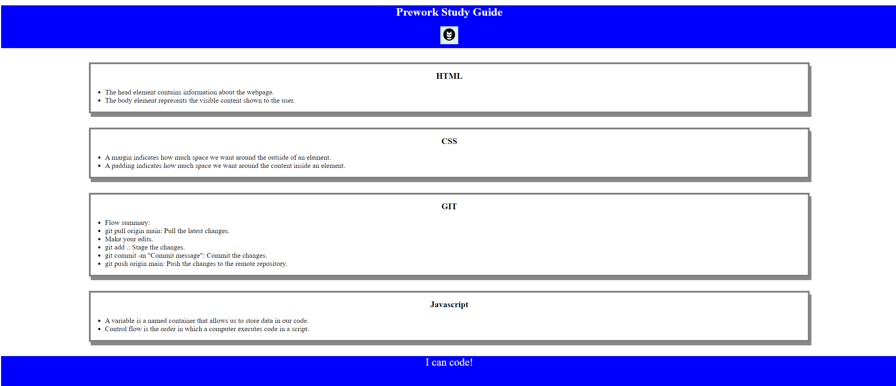

# Prework-Study-Guide-Webpage

## Description

The motivation behind this project was to prepare for my bootcamp studies by compiling a summary of notes on HTML, CSS, Git, and JavaScript. It serves as a guide to help avoid common mistakes and follow best practices when building a project. Through this process, I’ve enhanced my general knowledge, including learning how to create a professional README file, which is a critical component of project documentation.

## Installation

N/A

## Usage

The prework-study-guide provides helpful notes and guidelines for bootcamp preparation. It covers various topics and tips for better project management and development practices.

To use the guide, simply open the index file in your browser.

For suggestions on what to study first, open the Chrome DevTools by pressing Command+Option+I (macOS) or Control+Shift+I (Windows). A console panel should open either below or to the side of the webpage in the browser. There you will see a list of topics we learned from the prework along with a suggestion on which topic to study first.

## Credits

N/A

## License

This project is licensed under the MIT License. See the LICENSE in de repo for more details.

## Features

- Summarized study materials for bootcamp preparation.
- Easy-to-navigate sections on coding best practices.
- Customizable for future topics and updates.

## How to Contribute

If you'd like to contribute to this project, feel free to fork the repository and submit pull requests. Guidelines for contributions are forthcoming, but please be sure to maintain clarity and consistency with the current structure.

## Tests

simply open the index file in your browser and if you can see this you are doing good

